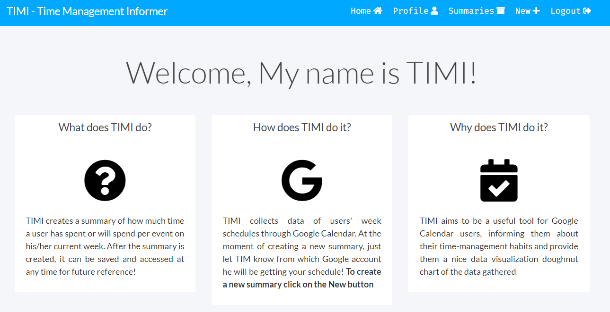

# TIMI- Time Management Informer

This project is a website called TIMI. My goal on developing TIMI was to create a useful tool that will inform Google Calendar users about their time-management habits and, at the same time, provide to them a nice visual representation of those habits.

What does TIMI do?

TIMI generates summaries of how much time a user has spent or will spend per event on his/her current week. Once a user has created an account on the website, he/she can let TIMI start generating summaries. Data used to generate summaries is collected from user's Google calendar. Summaries get saved can be re-accessed or deleted by the user at any given time on the "Summaries" page. Furthermore, summaries come with a nice colored-doughnut chart that displays the data gathered.

Website's main page:

 

Features to work on:

- Let the user pick the start and end date of the summary to be generated

- Design a mascot for the website. A nice and friendly Doughnut!!

- Improve the UI template of the Summaries PaGE

using Google's OAuth 2.0 protocol for authentication and Google Calendar's API

 Django web-framework and PostgreSQL database management system.

 this feature was achieved using Char.js library.
