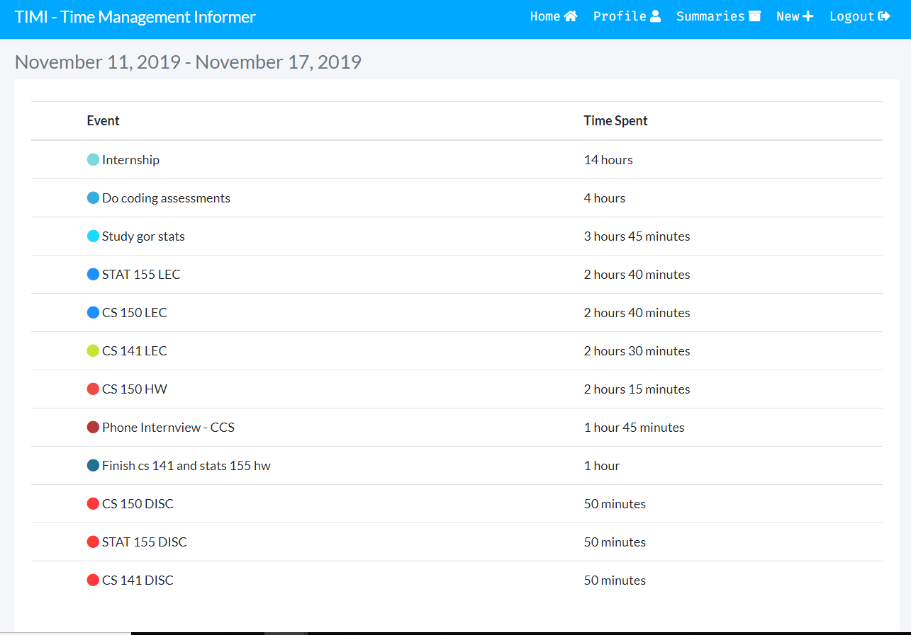
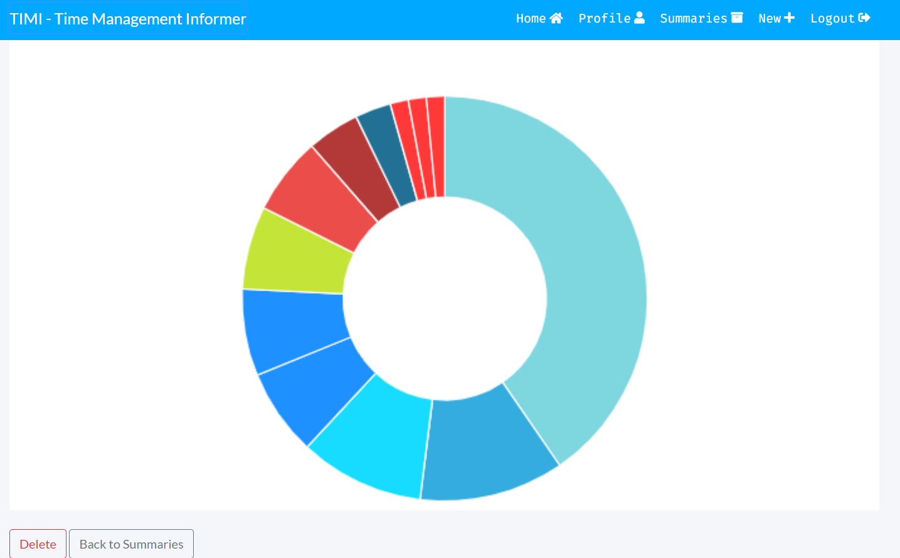

# TIMI- Time Management Informer

This project is a website called TIMI. My goal on developing TIMI was to create a useful tool that will inform Google Calendar users about their time-management habits and, at the same time, provide to them a nice visual representation of those habits.

### What does TIMI do?

TIMI generates summaries of how much time a user has spent or will spend per event on his/her current week. Once a user has created an account on the website, he/she can let TIMI start generating summaries. Data used to generate summaries is collected from user's Google calendar. Summaries get saved can be re-accessed or deleted by the user at any given time on the "Summaries" page. Furthermore, summaries come with a nice colored-doughnut chart that displays the data gathered. A recent feature let's the user know what activities he/she spent the most on time during the past three weeks. Data gathered to make this summary is pulled from user's summaries created during the past three weeks. This summary is displayed on the user's profile page. 

### Website's main page:

 

### Profile page:

### Summary page:

### Technologies learned:

 - Google's OAuth 2.0 protocol for authentication  
 - Google Calendar's API for collection of data from user's calendars
 - Django web-framework 
 - PostgreSQL database management system
 - Char.js library for doughnut charts

### Features to work on:

- Host TIMI online using Heroku

- Let the user pick the start and end date of the summary to be generated

- Design a mascot for the website. A nice and friendly Doughnut!!

- Improve the UI template of the Summaries Page

